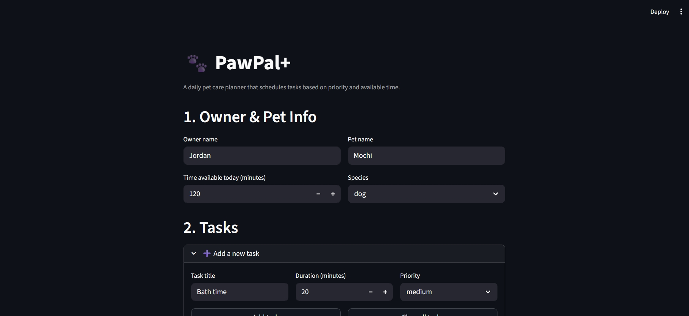

# PawPal+ (Module 2 Project)

You are building **PawPal+**, a Streamlit app that helps a pet owner plan care tasks for their pet.

## Scenario

A busy pet owner needs help staying consistent with pet care. They want an assistant that can:

- Track pet care tasks (walks, feeding, meds, enrichment, grooming, etc.)
- Consider constraints (time available, priority, owner preferences)
- Produce a daily plan and explain why it chose that plan

Your job is to design the system first (UML), then implement the logic in Python, then connect it to the Streamlit UI.

## What you will build

Your final app should:

- Let a user enter basic owner + pet info
- Let a user add/edit tasks (duration + priority at minimum)
- Generate a daily schedule/plan based on constraints and priorities
- Display the plan clearly (and ideally explain the reasoning)
- Include tests for the most important scheduling behaviors

## Features

### Smart Scheduling Logic
- **Priority-based scheduling** — tasks are always ordered `high → medium → low`. High-priority tasks (e.g., medication, feeding) are never pushed out by lower-priority ones.
- **Time-constraint enforcement** — the scheduler fits as many tasks as possible within your available time. Tasks that cannot fit are explicitly skipped with a reason.
- **Greedy fit within priority tier** — within the same priority level, shorter tasks are scheduled first to maximise the number of tasks that fit.
- **Conflict detection** — the UI warns you before scheduling if your total task time exceeds your available time, so you know to expect skipped tasks.
- **Duplicate task warning** — adding a task with the same name as an existing one triggers a warning instead of creating a confusing duplicate.

### Daily Schedule Display
- **Time slots** — every scheduled task shows an exact start and end time (e.g., 8:00 AM → 8:30 AM), starting from 8:00 AM.
- **Scheduling reason** — each task explains why it was chosen (priority level and available time fit).
- **Skipped task explanations** — skipped tasks show exactly how much time remained vs. how much the task needed.

### Sortable Task List
- Sort your task list by priority, duration (short → long or long → short), or original order — without affecting the schedule logic.

### Tested Scheduling Behaviors
- 14 automated tests cover priority ordering, time limits, edge cases, non-overlapping time slots, and input validation.
- Run with: `pytest test_scheduler.py`

---

## System Architecture

See `uml_final.md` for the full Mermaid class diagram.  
Key classes: `Owner` · `Pet` · `Task` · `Scheduler` · `DailyPlan` · `ScheduledTask`

---

## 📸 Demo

> After running the app, take a screenshot and save it as `screenshot.png` in this folder, then embed it here:

<a href="screenshot.jpeg" target="_blank">
  
</a>

---

## Getting started

### Setup

```bash
python -m venv .venv
source .venv/bin/activate  # Windows: .venv\Scripts\activate
pip install -r requirements.txt
```

### Suggested workflow

1. Read the scenario carefully and identify requirements and edge cases.
2. Draft a UML diagram (classes, attributes, methods, relationships).
3. Convert UML into Python class stubs (no logic yet).
4. Implement scheduling logic in small increments.
5. Add tests to verify key behaviors.
6. Connect your logic to the Streamlit UI in `app.py`.
7. Refine UML so it matches what you actually built.
