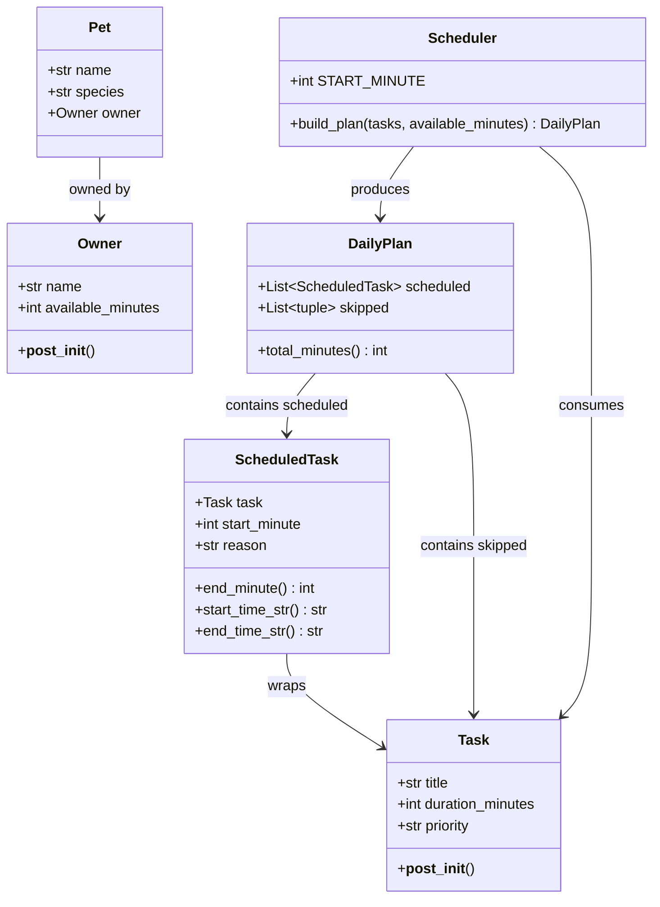

# PawPal+ Final UML — Class Diagram

Copy the Mermaid code below into https://mermaid.live to view and export as `uml_final.png`.



## How to export as PNG

1. Go to [https://mermaid.live](https://mermaid.live)
2. Paste the Mermaid code above into the editor
3. Click **Export → PNG**
4. Save the file as `uml_final.png` in this project folder

## Design notes

- `Scheduler` is stateless — it does not hold any pet or owner data, making it independently testable.
- `DailyPlan` separates `scheduled` (placed tasks) from `skipped` (tasks that did not fit), so the UI can display both clearly.
- `ScheduledTask` wraps a `Task` with a `start_minute` and a human-readable `reason`, keeping display logic out of `Task`.
- `Owner.available_minutes` is the single source of truth for the time constraint; the UI reads it and passes it to `Scheduler.build_plan()`.
```
